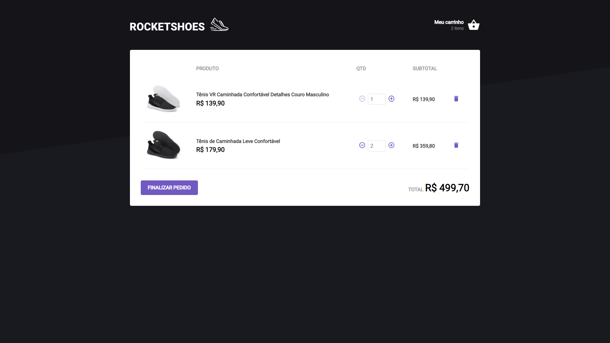

# RocketShoes




O RocketShoes é um simples e-commerce de sapatos desenvolvido dentro do curso curso Ignite da Rocketseat com o intuito de fixar os principais conceitos estudados na trilha React.

A aplicação realiza as seguintes funcionalidades:

- Adicionar um novo produto ao carrinho;
- Remover um produto do carrinho;
- Alterar a quantidade de um produto no carrinho;
- Cálculo dos preços sub-total e total do carrinho;
- Validação de estoque;
- Exibição de mensagens de erro;

## :wrench: Tecnologias

- [ReactJS](https://reactjs.org/)
- [Typescript](https://www.typescriptlang.org/)
- [styled-components](https://styled-components.com/)

## :computer: Instalação

### Requerimento
- Você precisa ter instalado o [Node.js](https://nodejs.org/en/download/) e [Yarn](https://yarnpkg.com/) para execultar esse projeto.

```bash
# Clone este repositório
$ git clone https://github.com/JoseVictorNascimento/challenge02-trilha-react-ignite.git

# Entre na pasta
$ cd challenge02-trilha-react-ignite

# Instale as dependências
$ yarn ou yarn install

# Execute a aplicação em modo de desenvolvimento
$ yarn dev

# O servidor inciará na porta:3000
acesse <http://localhost:3000>
```

## 📝 License

Este projeto está licenciado sob a Licença MIT - consulte o arquivo [LICENSE](LICENSE) para mais detalhes.

---

Feito com 💜 por Victor Nascimento
